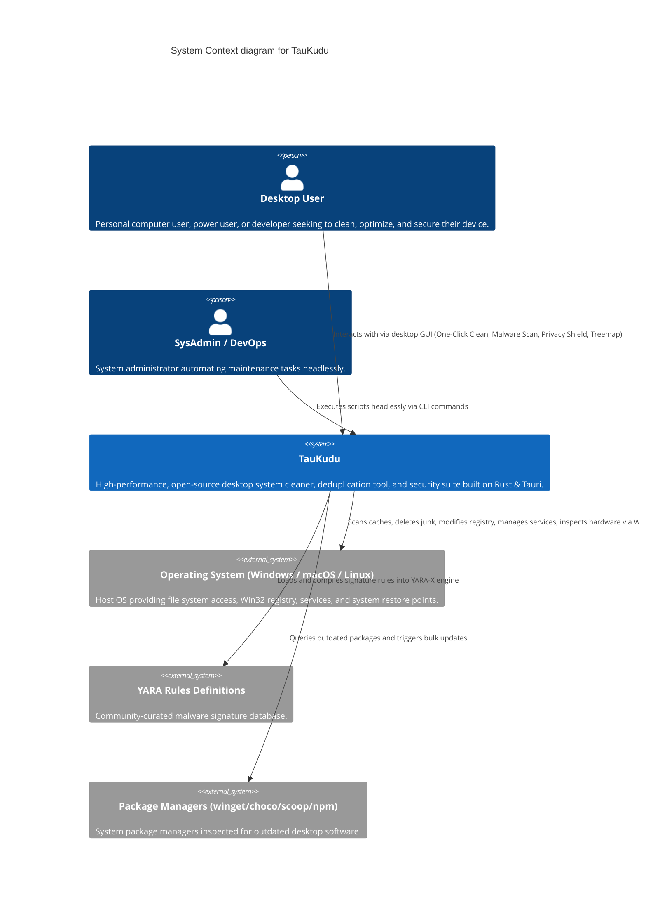

# C4 Level 1: System Context — TauKudu

```mermaid
C4Context
    title System Context diagram for TauKudu

    Person(user, "Desktop User", "Personal computer user, power user, or developer seeking to clean, optimize, and secure their device.")
    Person(admin, "SysAdmin / DevOps", "System administrator automating maintenance tasks headlessly.")

    System(taukudu, "TauKudu", "High-performance, open-source desktop system cleaner, deduplication tool, and security suite built on Rust & Tauri.")

    System_Ext(os, "Operating System (Windows / macOS / Linux)", "Host OS providing file system access, Win32 registry, services, and system restore points.")
    System_Ext(yara, "YARA Rules Definitions", "Community-curated malware signature database.")
    System_Ext(pkg_mgrs, "Package Managers (winget/choco/scoop/npm)", "System package managers inspected for outdated desktop software.")

    Rel(user, taukudu, "Interacts with via desktop GUI (One-Click Clean, Malware Scan, Privacy Shield, Treemap)")
    Rel(admin, taukudu, "Executes scripts headlessly via CLI commands")

    Rel(taukudu, os, "Scans caches, deletes junk, modifies registry, manages services, inspects hardware via Win32/POSIX APIs")
    Rel(taukudu, yara, "Loads and compiles signature rules into YARA-X engine")
    Rel(taukudu, pkg_mgrs, "Queries outdated packages and triggers bulk updates")
```
